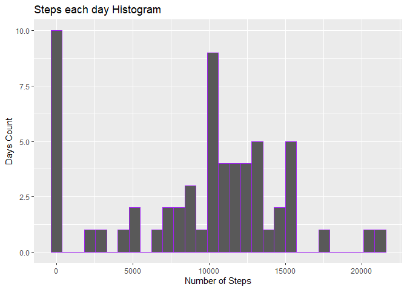
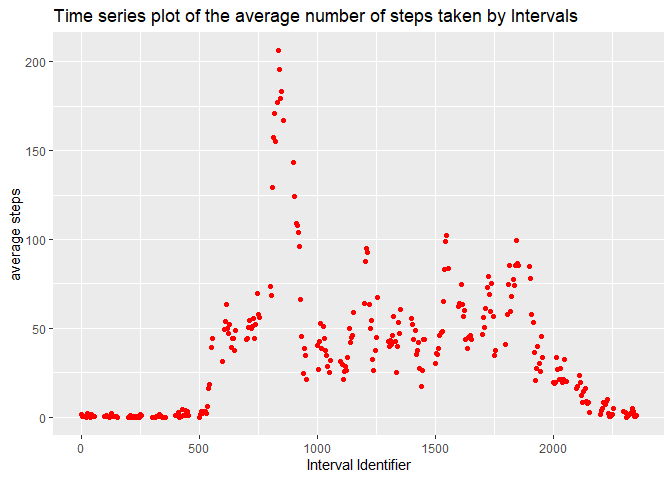
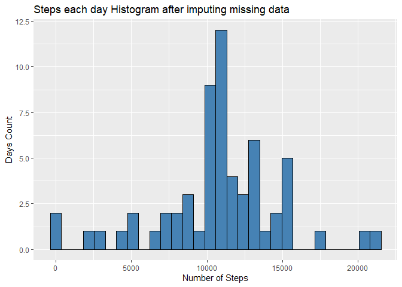
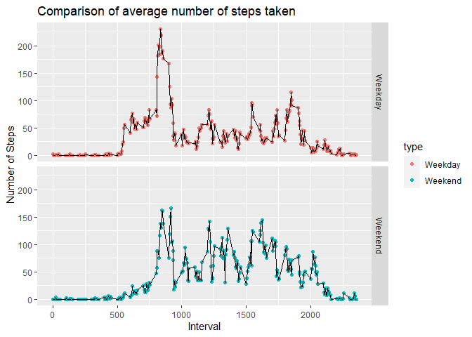

The following analysis have been done on the "Activity Monitoring" Dataset. 
[Download The dataset from here](https://d396qusza40orc.cloudfront.net/repdata%2Fdata%2Factivity.zip)

The codes have been written assuming that the zip file was extracted and the file "activity.csv" was copied to the working directory.

### 1. Code for reading in the dataset and/or processing the data


```r
data <- read.csv("activity.csv")
```

### 2. Histogram of the total number of steps taken each day
> Process: 

1. Read the data
2. Changed the date column into "date" format
3. Grouped the data by "date" and took summation of each days steps.
4. Made a histogram of steps using ggplot graphics.


```r
library(dplyr)
```

```
## 
## Attaching package: 'dplyr'
```

```
## The following objects are masked from 'package:stats':
## 
##     filter, lag
```

```
## The following objects are masked from 'package:base':
## 
##     intersect, setdiff, setequal, union
```

```r
library(ggplot2)

data <- read.csv("activity.csv")

data <- tbl_df(data)
data$date <- as.Date(data$date, "%Y-%m-%d")

grp_data <- data %>% group_by(date) %>% summarize(steps = sum(steps, na.rm = TRUE))

g <- ggplot(grp_data, aes(steps))

g + geom_histogram(color = "purple") + labs(x = "Number of Steps", y = "Days Count", title ="Steps each day Histogram")
```

```
## `stat_bin()` using `bins = 30`. Pick better value with `binwidth`.
```

<!-- -->

### 3. Mean and median number of steps taken each day
>Process:

1. Read the data
2. Changed the date column into "date" format
3. Grouped the data by "date" and took summation of each day steps.
4. calculated the Mean and Median of steps count for each day.


```r
library(dplyr)

data <- read.csv("activity.csv")

data <- tbl_df(data)
data$date <- as.Date(data$date, "%Y-%m-%d")

grp_data <- data %>% group_by(date) %>% summarize(steps = sum(steps, na.rm = TRUE))

mean(grp_data$steps, na.rm = TRUE)
```

```
## [1] 9354.23
```

```r
median(grp_data$steps, na.rm = TRUE)
```

```
## [1] 10395
```

### 4. Time series plot of the average number of steps taken
> Process: 

1. Read the data
2. Changed the date column into "date" format
3. Grouped the data by "interval identifier" and took mean of each Interval steps count
4. Made a time series plot using ggplot graphics


```r
library(dplyr)
library(ggplot2)

data <- read.csv("activity.csv")

data <- tbl_df(data)
data$date <- as.Date(data$date, "%Y-%m-%d")
grp_data <- data %>% group_by(interval) %>% summarize(steps = mean(steps, na.rm = TRUE))


g <- ggplot(grp_data, aes(interval, steps))

g + geom_point(color = "red") + labs(x = "Interval Identifier", y = "average steps", title = "Time series plot of the average number of steps taken by Intervals")
```

<!-- -->

### 5. The 5-minute interval that, on average, contains the maximum number of steps
> Process:

1. Read the data
2. Changed the date column into "date" format
3. Grouped the data by "interval identifier" and took mean of each Interval steps count
4. Found out the row with maximum value of steps count.


```r
library(dplyr)

data <- read.csv("activity.csv")

data <- tbl_df(data)
data$date <- as.Date(data$date, "%Y-%m-%d")
grp_data <- data %>% group_by(interval) %>% summarize(steps = mean(steps, na.rm = TRUE))

grp_data[which.max(grp_data$steps),]
```

```
## # A tibble: 1 x 2
##   interval steps
##      <int> <dbl>
## 1      835  206.
```

### 6. Code to describe and show a strategy for imputing missing data
>Process: 

1. Read the data
2. Changed the date column into "date" format
3. Grouped the data by "interval identifier" and took mean of each Interval steps count. Named it "donor" dataframe.
4. Created a new dat frame called "imputed" to input the imputed data of missing values.
5. took the values of steps from donor dataframe to the missing values of steps in imputed dataframe.


```r
library(dplyr)
library(ggplot2)

data <- read.csv("activity.csv")

data <- tbl_df(data)
data$date <- as.Date(data$date, "%Y-%m-%d")
#Donor dataframe of means of steps for each interval
donor <- data %>% group_by(interval) %>% summarize(steps = mean(steps, na.rm = TRUE))
#creating a DF "imputed" where imputed data will be stored 
imputed <- data
#filling up NA values from donor DF by means of that interval
imputed$steps[is.na(imputed$steps)] <- donor$steps

head(imputed)
```

```
## # A tibble: 6 x 3
##    steps date       interval
##    <dbl> <date>        <int>
## 1 1.72   2012-10-01        0
## 2 0.340  2012-10-01        5
## 3 0.132  2012-10-01       10
## 4 0.151  2012-10-01       15
## 5 0.0755 2012-10-01       20
## 6 2.09   2012-10-01       25
```

### 7. Histogram of the total number of steps taken each day after missing values are imputed
>Process: 

1. Read the data
2. Changed the date column into "date" format
3. Imputed the missing values(following the steps of "6")
4. Grouped the data by "date" and took sum of the steps count for each day.
5. Used ggplot graphics to make histogram of steps.


```r
library(dplyr)
library(ggplot2)

data <- read.csv("activity.csv")

data <- tbl_df(data)
data$date <- as.Date(data$date, "%Y-%m-%d")
#Imputing missing data
donor <- data %>% group_by(interval) %>% summarize(steps = mean(steps, na.rm = TRUE))
imputed <- data
imputed$steps[is.na(imputed$steps)] <- donor$steps

#summarizing by date
grp_data <- imputed %>% group_by(date) %>% summarise(steps = sum(steps))

g <- ggplot(grp_data, aes(steps))

g + geom_histogram(fill = "steelblue", color = "black") + labs(x = "Number of Steps", y = "Days Count", title = "Steps each day Histogram after imputing missing data") 
```

```
## `stat_bin()` using `bins = 30`. Pick better value with `binwidth`.
```

<!-- -->

### 8. Panel plot comparing the average number of steps taken per 5-minute interval across weekdays and weekends
> Process: 

1. Read the data
2. Changed the date column into "date" format
3. Imputed the missing values(following the steps of "6")
4. Used the chron package's "is.weekend" function to check whether it's a weekend or not and added it to isWeekend column
5. Ran ifelse boolean function on isWeekend and made a new column "Type" that would return "Weekend" if true and "Weekday" if false. Telling whether day is a weekday or a weekend
6. used ggplot graphics to create a time series plot with faceted grids on weekday and weekend on the average number of steps taken per 5-minute interval


```r
library(dplyr)
library(ggplot2)
library(chron)
```

```
## NOTE: The default cutoff when expanding a 2-digit year
## to a 4-digit year will change from 30 to 69 by Aug 2020
## (as for Date and POSIXct in base R.)
```

```r
data <- read.csv("activity.csv")

data <- tbl_df(data)
data$date <- as.Date(data$date, "%Y-%m-%d")
#Imputing missing data
donor <- data %>% group_by(interval) %>% summarize(steps = mean(steps, na.rm = TRUE))
imputed <- data
imputed$steps[is.na(imputed$steps)] <- donor$steps

imputed$isWeekend <- is.weekend(imputed$date)

imputed$type <- ifelse(imputed$isWeekend == TRUE, "Weekend", "Weekday")

grp_data <- imputed %>% group_by(interval, type) %>% summarize(steps = mean(steps))


g <- ggplot(grp_data, aes(interval, steps))

g + geom_point(aes(color = type)) + facet_grid(type~.) + geom_line() + labs(x = "Interval", y = "Number of Steps", title = "Comparison of average number of steps taken")
```

<!-- -->


